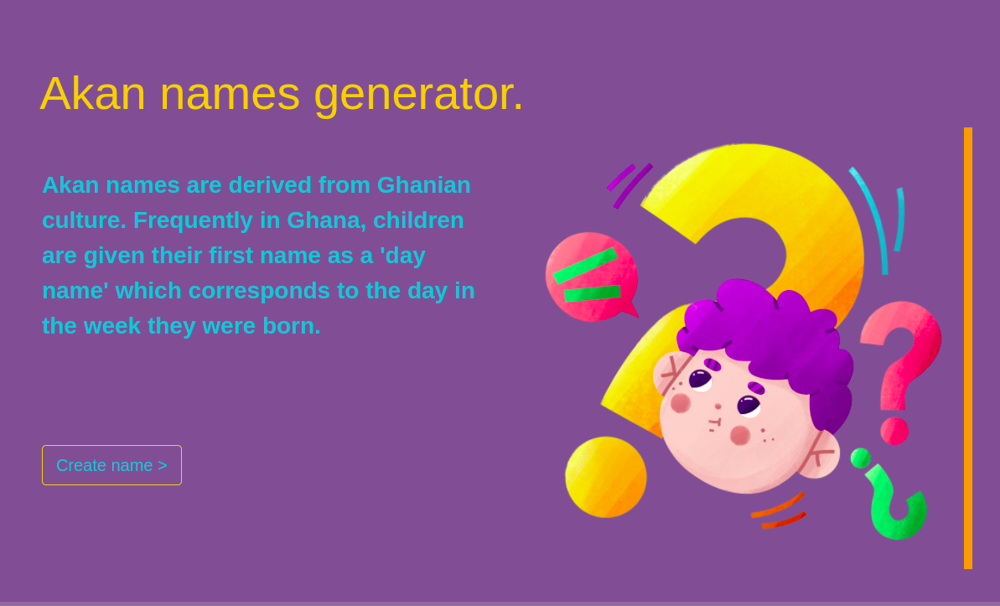
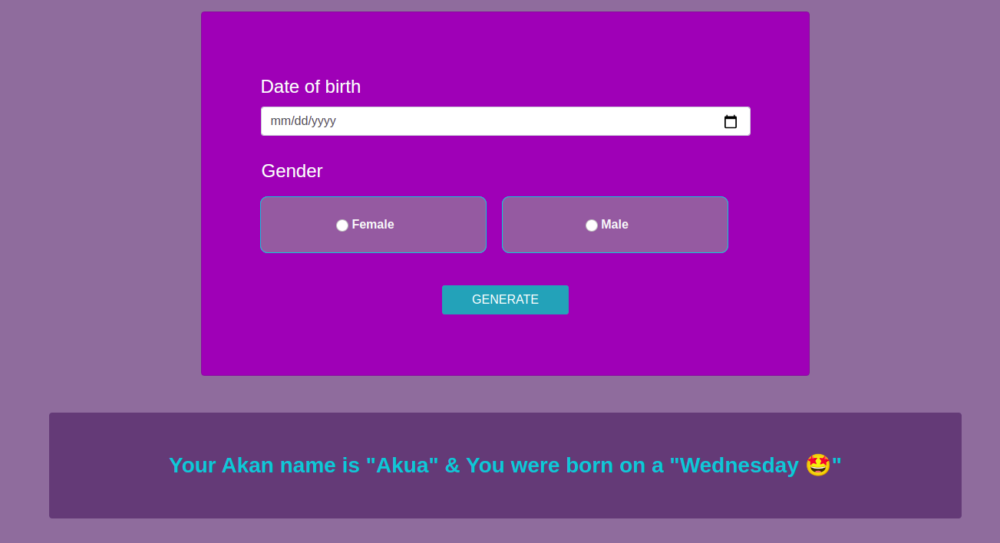

# akanames
>by willbeckh

## Description
Akanames is a web application that generates Akan names for usesrs according to the day they were born.
The user provides a date of birth and selects their gender, and the application gives the user an Akan name acoording to the specific day of they week they were born.
Akan names are derived in the Ghanaian culture where kids are named according to the day they were orn on.
- The applications [figma](https://www.figma.com/file/MWuud7FUj1btIO6vjdlrhD/Akan_name-Design?node-id=2%3A2) design.

## Technologies used
- HTML & CSS
- Bootstrap
- JavaScript

## Setup instructions
To setup this project:
- First clone `git clone https://github.com/Willbeckh/akaname.git`
- Open terminal and change into the project folder `cd akanames`.
- Open `index.html` in your editor and launch with live-server.

## Behaviour Driven Development (BDD).
1. Welcome landing page.
2. Displays form for providing user date of birth and gender.
  - INPUT: user picks date
  - INPUT: user selects gender.
  - OUTPUT: generates and displays an akan name corresponding to details provided.
3. Alerts an error message when user provides a future date.
  - INPUT: user picks a date ahead of current date.
  - OUTPUT: alerts error message to user and request an appropriate date.
4. Displays error message when user tries to submit without filling in the details.
  - INPUT: no details provided, example: date and gender.
  - OUTPUT: please pick a date and select a gender.
6. Resets form Input upon validation.
  - INPUT: user clicks generate button.
  - OUTPUT: resets form and display Akan name.

## Contributing
You like this project! Cool.
follow below steps:
- Fork the repo
- Create a new branch example:(git checkout -b ft-update-design);
- Make your desired changes.
- Stage and commit changes to your branch
- Push the changes/updates to remote branch (git push ft-update-design);
- Open a PR and request review.

### Known bugs.
- No current Known bugs, if you catch any bug, open a new [issue](https://github.com/Willbeckh/akaname/issues) and provide a description.

***Live site :*** https://willbeckh.github.io/akaname/

---
### License 
MIT License

Copyright (c) 2022 billy

Permission is hereby granted, free of charge, to any person obtaining a copy
of this software and associated documentation files (the "Software"), to deal
in the Software without restriction, including without limitation the rights
to use, copy, modify, merge, publish, distribute, sublicense, and/or sell
copies of the Software, and to permit persons to whom the Software is
furnished to do so, subject to the following conditions:

The above copyright notice and this permission notice shall be included in all
copies or substantial portions of the Software.

THE SOFTWARE IS PROVIDED "AS IS", WITHOUT WARRANTY OF ANY KIND, EXPRESS OR
IMPLIED, INCLUDING BUT NOT LIMITED TO THE WARRANTIES OF MERCHANTABILITY,
FITNESS FOR A PARTICULAR PURPOSE AND NONINFRINGEMENT. IN NO EVENT SHALL THE
AUTHORS OR COPYRIGHT HOLDERS BE LIABLE FOR ANY CLAIM, DAMAGES OR OTHER
LIABILITY, WHETHER IN AN ACTION OF CONTRACT, TORT OR OTHERWISE, ARISING FROM,
OUT OF OR IN CONNECTION WITH THE SOFTWARE OR THE USE OR OTHER DEALINGS IN THE
SOFTWARE.

Made with ❤️  by Willbeckh &copy; 2022
